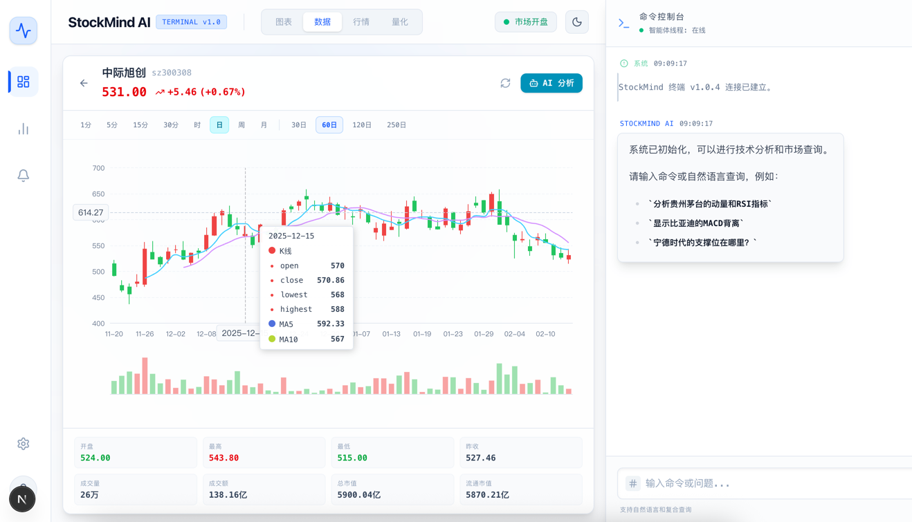
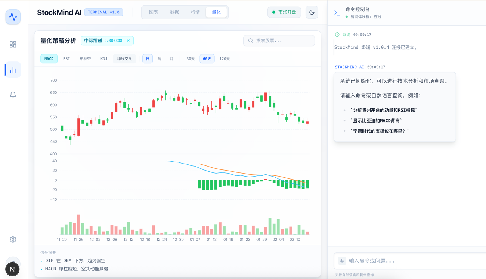

# StockMind AI

基于 AI 的智能股票分析终端，集成实时行情、K线图表、AI 对话分析和量化策略分析。

## 界面预览





## 功能特性

- **AI 对话分析** — 自然语言查询股票技术面和基本面，支持流式响应
- **实时行情看板** — 自选股管理、板块分类、实时价格轮询
- **K线图表** — 多周期（1分/5分/15分/30分/时/日/周/月）K线，支持成交量、MA均线
- **量化策略分析** — 内置五种经典技术指标，纯前端计算 + ECharts 可视化：
  - **MACD** — DIF/DEA/柱状图，动能趋势判断
  - **RSI** — 相对强弱指数，超买超卖信号
  - **布林带** — 上中下三轨，波动率和突破分析
  - **KDJ** — 随机指标，短期超买超卖
  - **均线交叉** — 双均线金叉/死叉信号检测
- **主题切换** — 支持亮色/暗色主题
- **状态持久化** — localStorage 保存会话、选股、tab 状态

## 技术栈

- **运行时**: Bun
- **前端**: Next.js 16 + React 19 + TypeScript + Tailwind CSS
- **图表**: ECharts (echarts-for-react)
- **后端**: Bun.serve() API 服务
- **AI**: DeepAgents 集成

## 快速开始

安装依赖：

```bash
bun install
```

启动开发服务器（前端 + API）：

```bash
bun run dev
```

- 前端: http://localhost:3134
- API: http://localhost:3135

生产构建：

```bash
bun run build
```

## 项目结构

```
src/
├── core/
│   └── api/          # Bun API 服务器
├── web/
│   ├── app/          # Next.js 页面
│   ├── components/   # React 组件
│   │   ├── Chat.tsx           # AI 对话界面
│   │   ├── StockChart.tsx     # ECharts 图表渲染
│   │   ├── StockDetail.tsx    # 股票详情（K线+行情）
│   │   ├── StockWatchlist.tsx # 自选股/行情看板
│   │   ├── QuantStrategy.tsx  # 量化策略分析页面
│   │   └── ThemeProvider.tsx  # 主题管理
│   └── lib/
│       ├── indicators.ts      # 技术指标计算（SMA/EMA/MACD/RSI/BOLL/KDJ/MA交叉）
│       └── indicatorCharts.ts # 各策略 ECharts 图表配置生成
```

## API 接口

| 接口 | 说明 |
|------|------|
| `GET /api/stocks/search?q=` | 股票搜索 |
| `GET /api/stocks/kline/:code?days=&klt=` | K线数据 |
| `GET /api/stocks/quote/:code` | 实时行情 |
| `POST /api/chat` | AI 对话（SSE 流式） |
