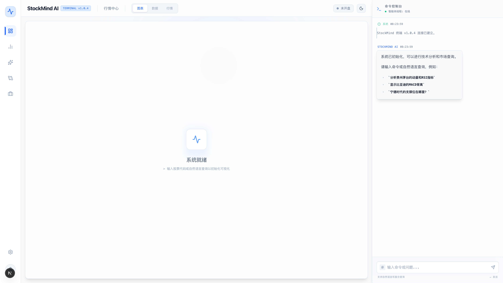
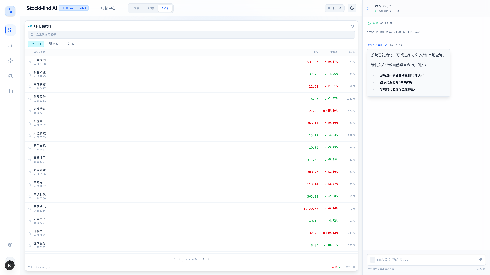
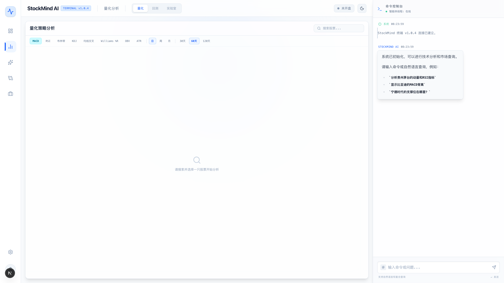
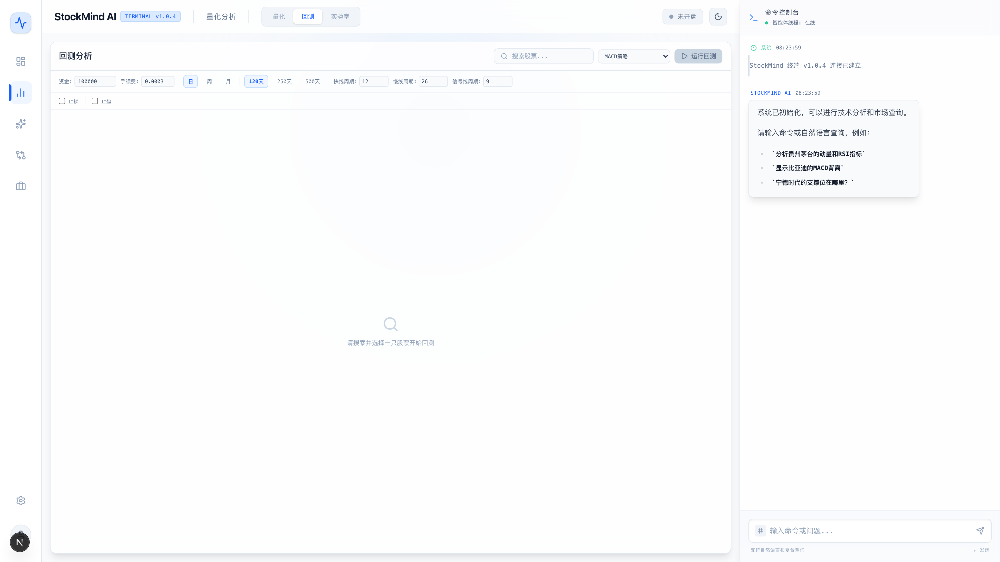
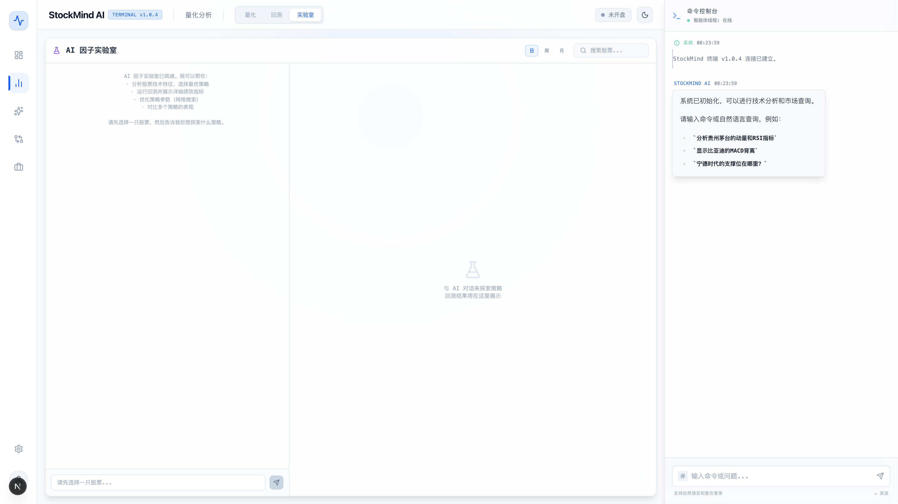
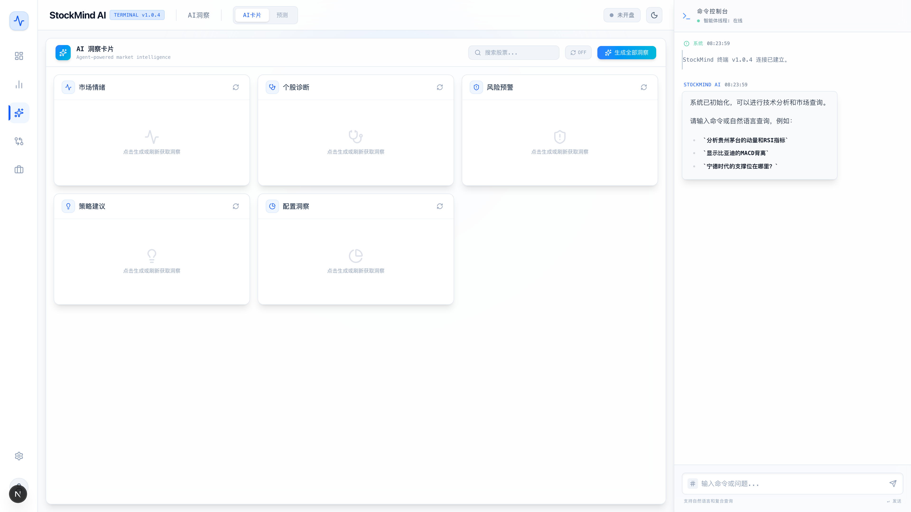
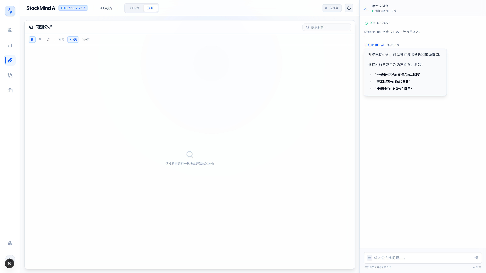
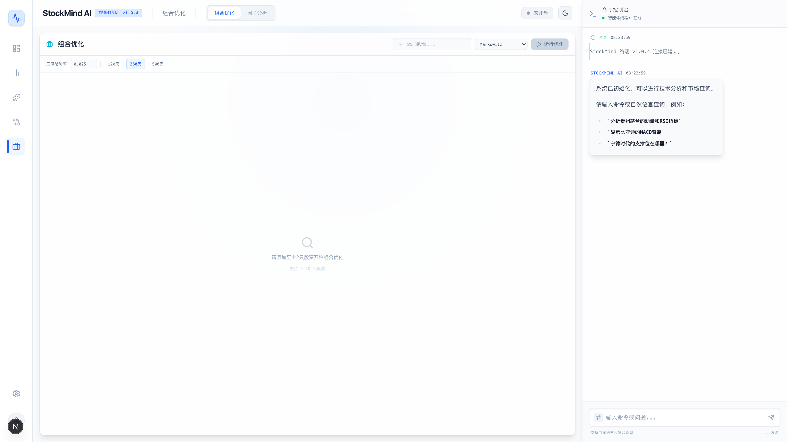
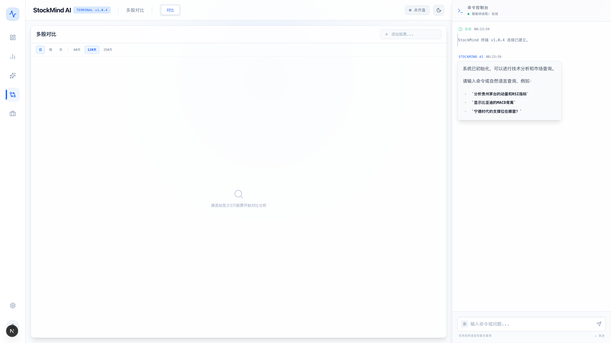

# StockMind AI

基于大模型的 A 股智能分析终端

融合 AI Agent 对话、量化回测、风险建模、组合优化于一体

<br/>

[](https://bun.sh)
[](https://nextjs.org)
[](https://react.dev)
[](https://typescriptlang.org)
[](https://langchain.com)
[](LICENSE)

</div>

<br/>


## 功能一览

**AI 智能分析** — 内置 16 种 Agent 工具，自然语言对话驱动股票分析，支持流式响应

**量化回测引擎** — 7 种交易策略 + DualThrust / 海龟突破，止损止盈、仓位管理、A 股 T+1 执行模型

**风险建模** — GARCH / EWMA 波动率、Cornish-Fisher VaR、蒙特卡洛模拟（t-分布 / 跳跃扩散）

**组合优化** — Markowitz 有效前沿 / 风险平价 / Black-Litterman，多因子选股

**22 个算法插件** — 8 个技术指标 + 7 个策略 + 4 个风险模型 + 3 个组合优化器，注册中心动态管理

---

## 界面预览

### 行情中心

| K 线图表 | 行情看板 |
|:---:|:---:|
|  |  |

### 量化分析

| 技术指标 | 策略回测 | AI 实验室 |
|:---:|:---:|:---:|
|  |  |  |

### AI 洞察与预测

| AI 洞察卡片 | AI 预测分析 |
|:---:|:---:|
|  |  |

### 组合优化与因子分析

| 组合优化 | 因子分析 | 多股对比 |
|:---:|:---:|:---:|
|  |  |  |

<details>
<summary><b>暗色主题</b></summary>
<br/>

| 行情图表 | AI 洞察 | 策略回测 |
|:---:|:---:|:---:|
|  |  |  |

</details>

---

## 详细特性

<details open>
<summary><b>AI 智能分析</b></summary>

- **自然语言对话** — 内置 16 种工具，支持 SSE 流式响应，一句话完成复杂分析
- **AI 洞察卡片** — 5 类大模型驱动分析卡片（市场情绪 / 个股诊断 / 风险预警 / 策略建议 / 配置洞察），支持自动刷新
- **AI 深度预测** — 综合技术面、基本面、新闻的多周期趋势预测
- **AI 策略实验室** — 对话式策略研究，自动运行回测，策略进化追踪

</details>

<details open>
<summary><b>量化引擎</b></summary>

- **8 种技术指标** — MACD / RSI / 布林带 / KDJ / 均线交叉 / WR / OBV / ATR
- **9 种交易策略** — 7 种内置 + DualThrust + 海龟突破，支持策略组合（投票 / 加权集成）
- **回测引擎** — 止损止盈（百分比 / ATR / 追踪）、仓位管理（固定比例 / Kelly / ATR）、A 股 T+1 / 涨跌停检测
- **参数优化** — 网格搜索 / 贝叶斯 GP-UCB / 差分进化
- **过拟合检测** — Walk-Forward 验证 + Deflated Sharpe Ratio

</details>

<details open>
<summary><b>风险与组合</b></summary>

- **VaR / CVaR** — 历史 / Cornish-Fisher 修正 / GARCH 条件异方差
- **波动率建模** — EWMA（λ=0.94）/ GARCH(1,1) MLE
- **蒙特卡洛模拟** — GBM / t-分布 / Merton 跳跃扩散
- **压力测试** — 5 种 A 股历史场景
- **组合优化** — Markowitz 有效前沿 / 风险平价 / Black-Litterman
- **因子分析** — 动量 / 波动率 / RSI / MACD 多因子选股，IC 值（Spearman 秩相关）
- **协方差估计** — Ledoit-Wolf 收缩

</details>

<details>
<summary><b>其他</b></summary>

- **多股对比** — 最多 5 只股票的归一化收益、波动率、相关性热力图
- **智能荐股** — 价值 / 成长 / 动量 / 红利 4 种风格，多因子评分推荐
- **亮色 / 暗色主题** — 一键切换
- **插件化架构** — 22 个算法插件，注册中心统一管理

</details>

---

## 快速开始

```bash
# 安装依赖
bun install

# 启动开发服务器（前端 :3134 + 后端 :3135）
bun run dev

# 生产构建
bun run build
```

在项目根目录创建 `.env` 文件：

```env
OPENAI_API_KEY=your-api-key
OPENAI_BASE_URL=https://openrouter.ai/api/v1
OPENAI_MODEL_NAME=anthropic/claude-3.7-sonnet
NEXT_PUBLIC_API_URL=http://localhost:3135
```

---

## 技术栈

| 层级 | 技术 |
|:---|:---|
| 运行时 | Bun |
| 前端 | Next.js 16 · React 19 · TypeScript · Tailwind CSS |
| 图表 | ECharts |
| 后端 | Bun.serve() 模块化路由 |
| AI | LangChain Agent · 16 种工具 |

---

## 项目结构

```
src/
├── core/                          # 后端
│   ├── api/
│   │   ├── server.ts              # 入口（路由分发）
│   │   └── routes/                # 路由模块
│   ├── agent/
│   │   ├── chatAgent.ts           # LangChain Agent 配置
│   │   └── tools/                 # 16 种 Agent 工具
│   └── services/
│       └── eastmoney.ts           # 东方财富 API
├── web/                           # 前端
│   ├── app/page.tsx               # 主页面
│   ├── components/                # 12 个界面组件
│   ├── lib/
│   │   ├── plugins/               # 22 个算法插件
│   │   ├── backtest.ts            # 回测引擎
│   │   ├── risk.ts                # 风险分析
│   │   ├── volatility.ts          # 波动率建模
│   │   ├── portfolio.ts           # 组合优化
│   │   └── ...                    # 更多算法模块
│   ├── types/                     # 共享类型
│   └── hooks/                     # 共享 Hook
└── scripts/
    └── screenshot.ts              # Playwright 自动截图
```

---

## 协议

[MIT](LICENSE)
