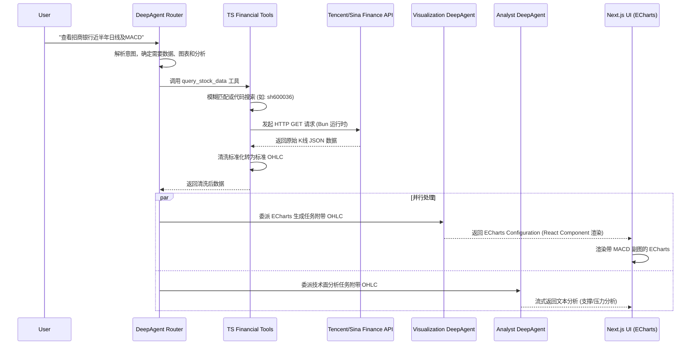

# StockMind AI: 智能A股分析可视化架构设计

## 项目愿景
StockMind AI 是一个基于大语言模型(Claude/DeepAgents)驱动的中国A股市场可视化分析辅助工具。用户可以通过自然语言与AI对话、查询股票历史数据（基于公开免费的HTTP JSON API，如腾讯/新浪财经）、生成可视化K线图表，并且AI具备持久化记忆能力以了解用户的投资偏好。

---

## 一、 系统架构设计

### 1. 前端架构 (User Interface & Visualization)
- **技术栈:** Next.js (React) + TypeScript + TailwindCSS
- **组件库:** shadcn/ui (提供流式对话UI组件)
- **图表库:** **Apache ECharts**
  - **原因:** ECharts 原生对金融K线图（Candlestick）支持极佳，内置了缩放、DataZoom（时间轴平移）以及多图表联动（例如主图显示K线+均线，副图显示成交量和MACD），非常适合A股复杂的分析需求。相比TradingView，ECharts更容易与React组件深度集成并由AI动态生成配置。

### 2. 后端架构 (API & Multi-Agent System)
- **运行时环境:** **Bun** (极速的 JavaScript/TypeScript 运行时)
- **技术栈:** Node.js 兼容层 (Next.js API Routes) + TypeScript
- **Agent 框架:** **LangChain @langchain/deepagents**
  - 构建多Agent（Multi-Agent）系统，使用 `createDeepAgent()` 及 `CompositeBackend` 实现任务路由和专业代理协作。
- **数据源:**
  - **公开金融计算服务 (A股历史数据):** 系统通过原生 TypeScript/JavaScript 工具(Tools)直接调用免费的 HTTP JSON 接口（例如新浪财经、腾讯财经）获取标准的股票交易日数据和实时行情，彻底摒弃重型Python中间件架构。
- **持久化存储:** PostgreSQL / SQLite (用于存储用户配置、记忆与会话历史)

---

## 二、 核心功能模块与组件设计

### 1. DeepAgents (多智能体协同)
我们将系统拆分为多个专业化 Sub-agents（子智能体）：

* **Router Agent (路由智能体 / 主 Agent):**
  * 职责: 接收用户的自然语言输入，识别意图（闲聊、查行情、深度分析、画图）。基于 `@langchain/deepagents` 实现意图分发。
  * 行为: 决定调用哪个下游子智能体 (Sub-agents) 或直接调用 Tools。
* **Data Fetcher Tools & Helpers (数据接入):**
  * 职责: 将用户的模糊查询转化为精确的公共HTTP API调用，使用 TS 获取、清洗并标准化股票JSON。
* **Visualization/Chart Agent (图表生成智能体):**
  * 职责: 拿到原始JSON数据后，生成对应的 `ECharts` 配置项 (Option Object)，并将配置项返回给前端直接渲染。
* **Analyst Agent (金融分析师智能体):**
  * 职责: 基于K线数据、技术指标（MA, MACD, BOLL）和用户偏好，提供客观的走势解读和支撑压力位分析。

#### 多智能体交互流程图 (Multi-agent Chat Flow)



### 2. 核心 Tool API 契约定义 (Internal TypeScript Tool Definitions)
在 Next.js / Bun 架构下，我们不再需要独立的 Python API 服务。所有数据获取都封装在 LangChain Agents 可直接调用的 Native Tools (TypeScript) 中。

**Tool Name: query_stock_data**
- **描述:** 从公共金融 API 获取标准化股票K线历史数据。
- **Agent Input Arguments:**
  - `code` (string, required): 股票代码 (例如: `sh600036`)
  - `start_date` (string, optional): 开始日期 `YYYY-MM-DD`
  - `end_date` (string, optional): 结束日期 `YYYY-MM-DD`
  - `period` (string, optional): 数据周期，如 `daily`, `weekly`, `monthly`, `5min`。
- **Internal Output Format (JSON fed back to Agents/UI):**
  ```json
  {
    "status": "success",
    "meta": {
      "code": "sh.600036",
      "frequency": "d",
      "start_date": "2023-08-01",
      "end_date": "2024-02-01"
    },
    "data": [
      {
        "date": "2023-08-01",
        "open": 32.10,
        "high": 33.00,
        "low": 31.80,
        "close": 32.50,
        "volume": 1205000,
        "amount": 39045000,
        "turn": 0.58
      }
      // ...
    ]
  }
  ```

**Tool Name: search_stock_code**
- **描述:** 根据中文名称或拼音从本地字典或搜索 API 中获取正确的股票代码。
- **Agent Input Arguments:**
  - `query` (string, required): 股票名称 (例如: "平安银行" 或 "pingan")
- **Internal Output Format (JSON):**
  ```json
  {
    "status": "success",
    "data": [
      {
        "code": "sz.000001",
        "name": "平安银行"
      }
    ]
  }
  ```

### 3. 会话隔离与持久化记忆 (Session & Memory)

#### 持久化记忆数据结构 (Memory Format)
Agent使用**Memory Tool**管理用户的长期偏好。这些记忆会在每次会话初始化时注入到System Prompt中。

**System Instruction 注入示例:**
```text
You are StockMind AI.
<user_profile>
  <preference>
    - 风险偏好: 稳健型，注重基本面和长期价值
    - 操作风格: 中长线 (一般持仓 3-6个月)
    - 止损设定: 亏损超过 8% 需要立即提醒
    - 常用指标: MACD, KDJ, MA(5,10,20)
  </preference>
  <history>
    - 2026-01-15: 询问了关于新能源车板块的反弹机会
    - 2026-02-01: 购入了宁德时代 (sz.300750) 观察仓
  </history>
</user_profile>
```

#### Memory Tool Schema (Tool Use)
```json
{
  "name": "update_user_memory",
  "description": "Updates the user's persistent profile and preferences based on conversation history.",
  "input_schema": {
    "type": "object",
    "properties": {
      "category": {
        "type": "string",
        "description": "Category of the memory (e.g., 'risk_tolerance', 'indicators', 'trading_style')",
        "enum": ["risk_tolerance", "indicators", "trading_style", "portfolio_observation"]
      },
      "content": {
        "type": "string",
        "description": "The specific information to remember."
      }
    },
    "required": ["category", "content"]
  }
}
```

### 4. 动态能力扩展 (Action Space / Tools Schema)
Agent 通过工具调用来执行实际操作。以下是核心工具的Schema定义：

#### Data API Tool Schema (获取K线数据工具)
```json
{
  "name": "query_stock_data",
  "description": "Fetches historical K-line data for a specific stock code via public APIs.",
  "input_schema": {
    "type": "object",
    "properties": {
      "code": {
        "type": "string",
        "description": "The target stock code without dots (e.g., 'sh600519', 'sz000001')."
      },
      "start_date": {
        "type": "string",
        "description": "Start date for data fetch in YYYY-MM-DD format."
      },
      "end_date": {
        "type": "string",
        "description": "End date for data fetch in YYYY-MM-DD format."
      },
      "period": {
        "type": "string",
        "description": "Data frequency (daily, weekly, monthly).",
        "default": "daily",
        "enum": ["daily", "weekly", "monthly", "5min", "15min", "30min", "60min"]
      }
    },
    "required": ["code", "start_date", "end_date"]
  }
}
```

#### Chart Agent Tool - ECharts 配置项生成器
```json
{
  "name": "generate_echarts_config",
  "description": "Generates an Apache ECharts option JSON object based on the provided technical data and requirements.",
  "input_schema": {
    "type": "object",
    "properties": {
      "data_source_id": {
        "type": "string",
        "description": "Reference ID to the fetched market data."
      },
      "chart_type": {
        "type": "string",
        "description": "Primary chart type.",
        "enum": ["candlestick", "line", "bar"]
      },
      "indicators": {
        "type": "array",
        "items": { "type": "string" },
        "description": "List of technical indicators to overlay or show in sub-charts (e.g., ['MA', 'MACD', 'VOL'])."
      },
      "theme": {
        "type": "string",
        "description": "Color theme for the chart.",
        "enum": ["dark", "light"],
        "default": "dark"
      }
    },
    "required": ["data_source_id", "chart_type"]
  }
}
```

---

## 三、 数据链路设计 (Data Flow)

1. **用户输入:** "帮我看下招商银行最近半年的日线图，加上MACD指标。"
2. **路由分配:** Router Agent 识别出需要：获取数据 + 计算指标 + 绘图。
3. **参数提取:** Agent 提取关键信息 `[name: "招商银行", timeframe: "6 months", indicators: ["MACD"]]`，并调用 `search_stock_code` 获得 `sh.600036`。
4. **数据请求:** DeepAgent 调用 `query_stock_data` 工具发起原生 HTTP GET 请求 `https://stock.finance.sina.com.cn.../sh600036`，并获取 JSON。
5. **指标计算:** TypeScript 计算逻辑计算出 MACD 的 DEA/DIF/MACD 序列。
6. **图表构建:** Visualization Agent 返回构建好的完整包含了双轴或上下副图的 ECharts Option Object 对象 JSON 结构。
7. **渲染返回:** 前端基于 ECharts React 组件接管并渲染出带 MACD 的专业 K线图，并结合 Analyst Agent 输出的文字行情分析同步反馈给用户。

---

## 四、 实施路线图 (Next Steps)

1. **Phase 1: 基础设施核心化与数据接入**
   - 初始化 Next.js + Tailwind 框架以及 Bun 环境。
   - 实现 TypeScript 原生公共 HTTP 数据爬取抓取与封装。
2. **Phase 2: 接入 LangChain DeepAgents**
   - 接入 `@langchain/deepagents`。
   - 编写 `query_stock_data` 和 `generate_echarts_config` 的 Agent Tools。
3. **Phase 3: 复杂可视化呈现与记忆整合**
   - 集成 ECharts 实现动态渲染图表与响应式交互引擎。
   - 通过记忆机制管理用户的偏好模型。
